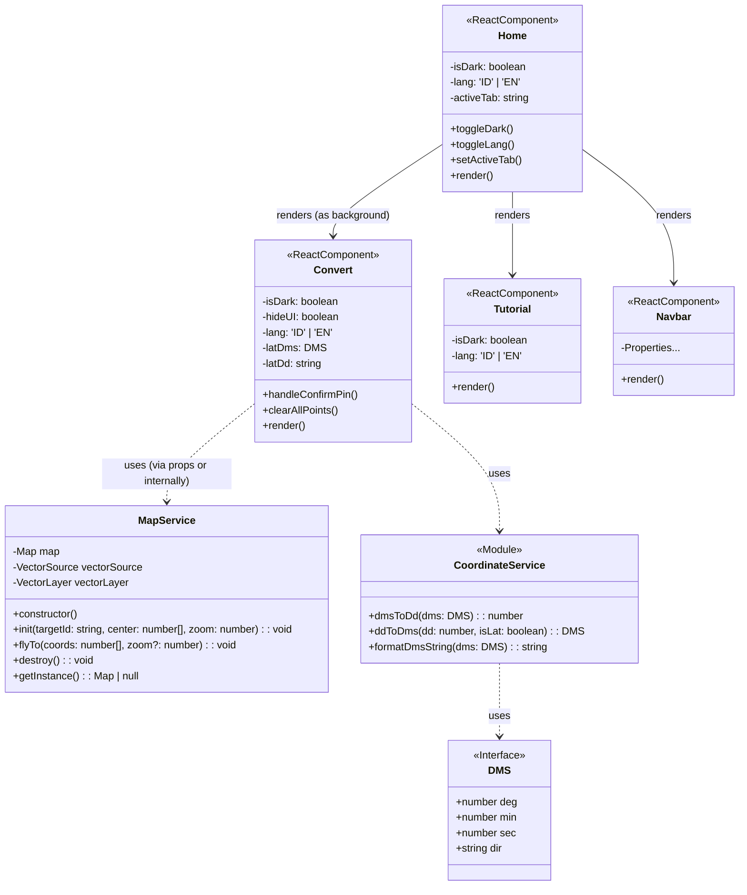

# Class Diagram: PT LEN Geospatial System

## Overview
Diagram ini merepresentasikan struktur class dan relasi antar komponen dalam aplikasi **GeoConvert**.

## Penjelasan Komponen

1.  **MapService**: Kelas pengendali utama untuk OpenLayers. Menangani inisialisasi peta, layer vektor, dan animasi kamera (`flyTo`). Menggunakan pola Singleton.
2.  **CoordinateService**: Himpunan fungsi utilitas murni untuk mentransformasi data koordinat (DMS <-> DD). Tidak menyimpan state.
3.  **Home**: Komponen halaman utama (Container). Mengelola state global aplikasi seperti tema (`isDark`) dan bahasa (`lang`). Mengatur navigasi antar tab (`Convert` vs `Tutorial`).
4.  **Convert**: Komponen inti aplikasi. Menampilkan peta (bisa dalam mode full UI atau background-only) dan form input untuk konversi.
5.  **Tutorial**: Komponen statis/interaktif untuk panduan pengguna.
