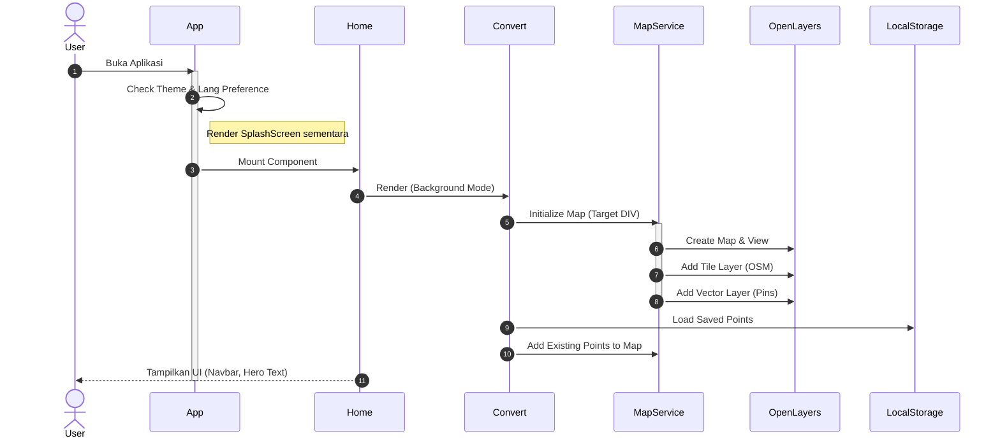
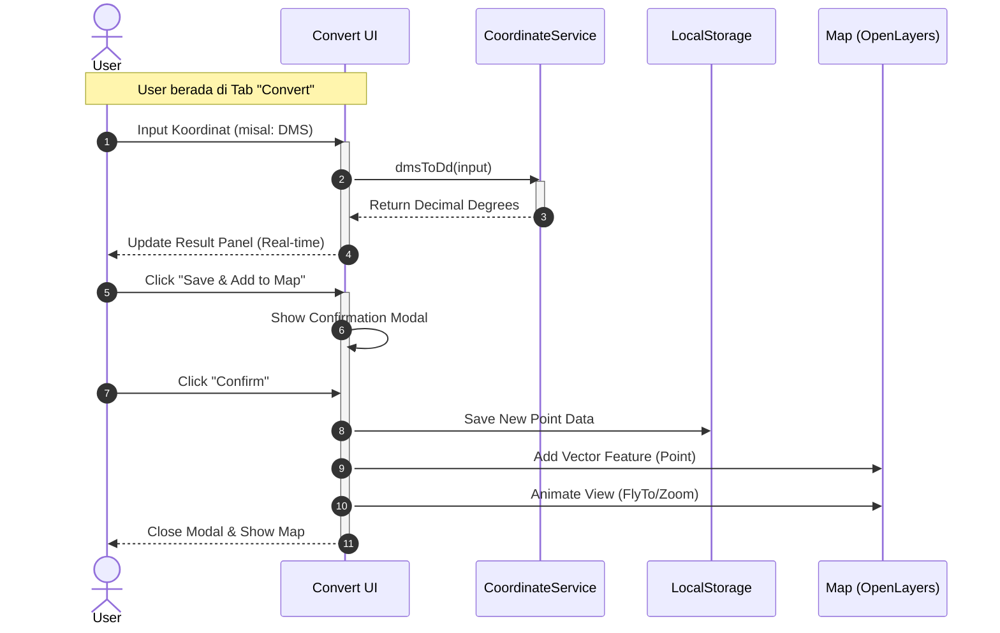

# Sequence Diagram: PT LEN Geospatial System

## 1. App Initialization & Map Loading Flow
Proses ini menggambarkan bagaimana aplikasi dimuat pertama kali hingga peta siap digunakan.

## 2. Coordinate Conversion & Pinning Process
Proses inti dimana pengguna melakukan konversi koordinat dan menyimpannya ke peta.

